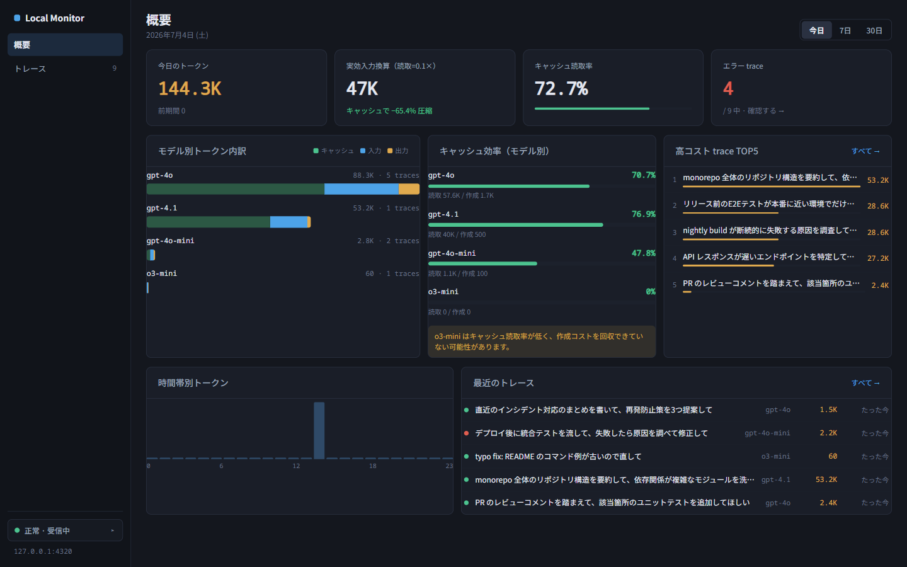
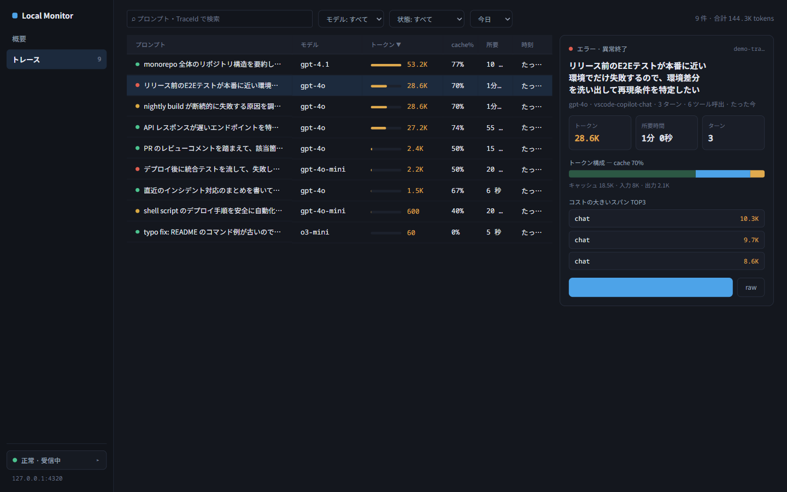
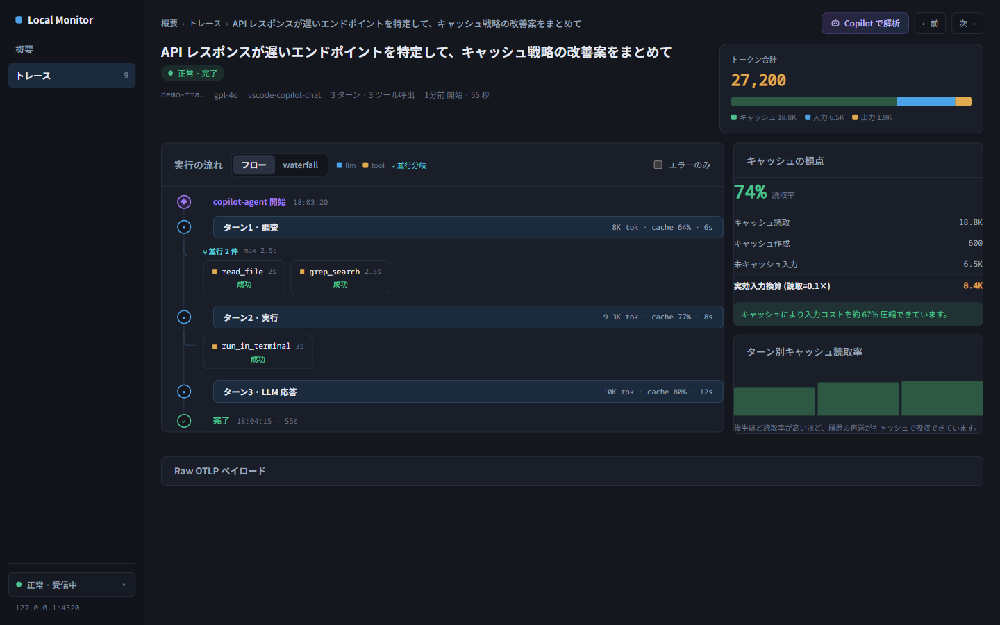
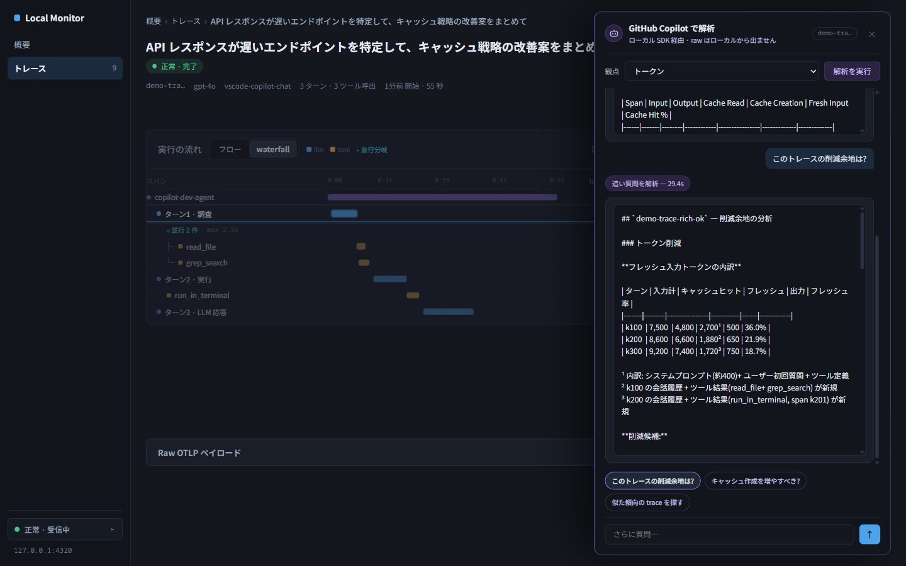
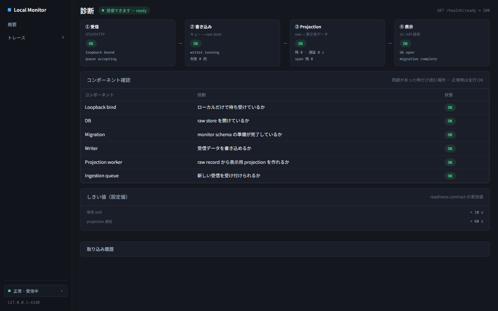

# Copilot Agent Observability

GitHub Copilot Chat、Copilot CLI、Codex App が出力する OpenTelemetry データを収集し、  
**エージェントが何をしたかを trace・集計・診断の三層で確認できる、Local-first な観測基盤**です。

---

## 何ができるようになるか

### Copilot が「何をしたか」をトレース単位で見る

Copilot は内部で多くのステップを踏んでいます。LLM を何回呼んだか、どのツールを呼んだか、何秒かかったか、どこでエラーが起きたか——通常これらはブラックボックスです。

このプロダクトを使うと、Copilot が出力する OpenTelemetry データをローカルに収集し、  
**ひとつひとつの実行ステップを span ツリーとして可視化**できるようになります。

- VS Code Copilot Chat のチャット実行、Copilot CLI のコマンド実行を計装なしで観測
- ツール呼び出しの階層（親子 span）・所要時間・引数と戻り値をその場で確認
- エラーが発生した span を即座に特定し、どのステップで失敗したかを調査
- 入力プロンプトでもセッションを識別できるため、「あのチャット実行」をすぐに見つけられる

### 傾向と改善候補を集計・俯瞰する

個別調査だけでなく、蓄積したトレースデータから傾向を把握できます。

- エラー率・実行時間・トークン使用量を集計した **Static Dashboard** を生成
- 失敗傾向や長時間実行をヒューリスティックで検出した **診断候補** を一覧表示
- baseline / variant / experiment ごとにデータセットを比較
- GitHub Pages へ snapshot として保存し、レビュワーと共有

### プロンプトや skill の改善サイクルを回す

「このプロンプトの変更でエラーが減ったか」「このツール呼び出しは本当に必要だったか」を  
再現可能なデータパイプラインで確認できます。

- saved raw OTLP JSON → SQLite raw store → normalized dataset → dashboard dataset の一貫した変換
- deterministic CLI による diagnosis / improvement / decision candidate 生成
- すべてのステップがコマンド一発で再実行可能

---

## Local Ingestion Monitor

VS Code Copilot Chat から直接テレメトリを受信し、ローカル DB に蓄積してブラウザで確認できる  
**ローカルのみで動く観測 UI** です（`http://127.0.0.1:4320`）。

### 概要ダッシュボード

トークンコストの把握を最優先にした KPI ダッシュボードです。

<p align="center">
  
</p>

今日 / 7日 / 30日のトークン合計・実効入力換算・キャッシュ読取率・エラー trace 数を即時把握。  
モデル別トークン内訳とキャッシュ効率、高コスト trace TOP5、時間帯別分布、最近のトレースから
気になる trace へ直接ジャンプできます。

### トレース一覧（master-detail）

保存されたすべての実行トレースをテーブル + 右プレビューで絞り込みます。

<p align="center">
  
</p>

プロンプト・モデル・状態（正常 / 回復済みエラー / 異常終了）・期間でフィルタし、
トークン・所要・時刻でソート。行を選ぶとページ遷移なしで右パネルにミニ KPI・
トークン構成・高コストスパン TOP3 が表示されます。各トレースは入力プロンプトで識別できます（既定）。

### トレース詳細（フロー / waterfall + キャッシュ列）

エージェントの実行の流れをターン単位で調査します。

<p align="center">
  
</p>

- **フロー / waterfall 切替**: ターンカードの時系列表示と時間軸バー表示をワンクリックで切替。並行ツール呼出は「⑂ 並行 N 件」、失敗 → 再試行は回復ペアとして表現
- **常設キャッシュ列**: 読取率・実効入力換算・ターン別キャッシュ読取率を常時表示
- **スパンインスペクタ**: スパンをクリックすると整形（メッセージ構成・トークン内訳）と raw（OTLP span JSON 全文）を右パネルで確認
- **エラー解析モード**: エラーを含む trace ではエラー要約・エラー一覧（回復済み / 未回復）・入力トークン推移（128K 目安線）に自動で切替

「なぜ意図しない回答をしたか」「どのツールがボトルネックか」「キャッシュは効いているか」を根本原因レベルで調べられます。

### Copilot 解析ドロワー

captured raw trace をローカルの GitHub Copilot SDK で解析します。

<p align="center">
  
</p>

観点（トークン / キャッシュ / エラー / 遅延 / ツール利用 / エージェントの流れ）を選んで実行し、
所見にチャット形式で追い質問できます。raw データはローカルから出ません。

### 診断

取り込みパイプラインの健全性を段階的動線で確認します。

<p align="center">
  
</p>

サイドバーの受信ステータスバッジ → ポップオーバー → 詳細診断の順に、受信 / 書き込み /
Projection / 表示の 4 段の状態、readiness しきい値、取り込み履歴を確認できます。

---

## 必要なもの

### 最低動作条件（raw-only モード）

Docker も Langfuse も不要。保存済みの raw OTLP JSON さえあれば、データパイプライン全体を試せます。

| 必要なもの | 用途 |
| --- | --- |
| .NET SDK | Config CLI のビルドと実行 |
| PowerShell | Windows 向けコマンド例の実行 |

合成データだけで dashboard まで試す:

```powershell
New-Item -ItemType Directory -Force tmp\dashboard-demo | Out-Null
dotnet run --project src\CopilotAgentObservability.ConfigCli -- normalize-raw tests\CopilotAgentObservability.ConfigCli.Tests\TestData\raw-otlp.synthetic.json --json tmp\dashboard-demo\measurements.json
dotnet run --project src\CopilotAgentObservability.ConfigCli -- generate-dashboard-dataset tmp\dashboard-demo\measurements.json --raw tests\CopilotAgentObservability.ConfigCli.Tests\TestData\raw-otlp.synthetic.json --json tmp\dashboard-demo\dashboard.json
dotnet run --project src\CopilotAgentObservability.ConfigCli -- generate-static-dashboard tmp\dashboard-demo\dashboard.json --out-dir tmp\dashboard-demo\site
```

### ライブトレース収集（推奨）

Copilot の実行をリアルタイムで収集するには、テレメトリの送信先が必要です。

| 追加で必要なもの | 用途 |
| --- | --- |
| GitHub Copilot が使えるアカウント | Copilot Chat / CLI の実行 |
| VS Code + GitHub Copilot Chat 拡張 | VS Code 側テレメトリの発生源 |
| GitHub Copilot CLI | CLI 側テレメトリの発生源 |
| Docker Desktop または WSL2 Docker Engine | Langfuse をローカルで起動する場合 |

送信先は **collection profile**（環境変数 `CAO_COLLECTION_PROFILE`）で選択します。

| Profile | 用途 |
| --- | --- |
| `raw-local-receiver` | Docker 不要。このリポジトリの Local Ingestion Monitor へ直接送信 |
| `docker-desktop-langfuse` | Docker Desktop 上の Langfuse へ送信（標準フル構成） |
| `docker-desktop-collector-langfuse` | Collector 経由で Langfuse へ relay |
| `wsl2-docker-langfuse` | WSL2 Docker Engine 上の Langfuse へ送信 |
| `wsl2-docker-collector-langfuse` | WSL2 Docker Engine 上の Collector 経由で Langfuse へ relay |
| `remote-managed-langfuse` | 管理された remote Langfuse endpoint へ送信 |
| `remote-managed-collector` | 管理された remote Collector endpoint へ送信 |

### 任意

| 追加で必要なもの | 用途 |
| --- | --- |
| Codex App / app-server | Codex App のテレメトリも収集したい場合 |

---

## GitHub Copilot のガイド付きセットアップ

Config CLI の reversible setup は、変更内容を先に redacted plan として保存し、返された
`change_set_id` を指定した場合だけ適用します。Repository では次の順に実行します。

```powershell
pwsh scripts\local-monitor\setup.ps1 plan --adapter github-copilot --target all
pwsh scripts\local-monitor\setup.ps1 apply --change-set <change-set-id>
pwsh scripts\local-monitor\setup.ps1 status --adapter github-copilot
pwsh scripts\local-monitor\setup.ps1 rollback --change-set <change-set-id>
```

Windows x64 Release ZIP では、同じ引数を `.\scripts\setup.ps1` に渡します。ZIP 内の
self-contained Config CLI を直接使うため、.NET SDK / Runtime は不要です。各コマンドは
stdout に 1 個の `setup.v1` JSON を返します。

`success: true` は静的な構成検証の成功であり、テレメトリが到着した証拠ではありません。
初回 trace 確認は Issue #69 の責務です。`run_first_trace_doctor` はその handoff 用に
予約された action 名ですが、現在の production setup result は返しません。
詳しい対象範囲と rollback 条件は
[Local Ingestion Monitor ガイド](docs/user-guide/local-monitor.md)を参照してください。

---

## クイックスタート（Docker Desktop + Langfuse）

1. Docker Desktop を起動し、Langfuse self-host をローカルで起動する
2. Langfuse でプロジェクトと API key を作成する
3. Config CLI で VS Code / Copilot CLI 向けの OTel 設定を出力する
4. VS Code Copilot Chat または Copilot CLI を OTel 設定付きで起動する
5. 検証用または合成データのみで Copilot を実行する
6. Langfuse UI でトレースを確認する
7. saved raw OTLP JSON がある場合は raw data loop と static dashboard を生成する

```powershell
# VS Code / CLI 向け設定を出力
dotnet run --project src\CopilotAgentObservability.ConfigCli -- profile-vscode-env --profile docker-desktop-langfuse
dotnet run --project src\CopilotAgentObservability.ConfigCli -- profile-copilot-cli-env --profile docker-desktop-langfuse

# raw OTLP JSON を取り込んで dashboard まで生成
dotnet run --project src\CopilotAgentObservability.ConfigCli -- ingest-raw <raw.json> --db data\raw-store.db
dotnet run --project src\CopilotAgentObservability.ConfigCli -- normalize-raw data\raw-store.db --json tmp\measurements.json
dotnet run --project src\CopilotAgentObservability.ConfigCli -- generate-dashboard-dataset tmp\measurements.json --json tmp\dashboard.json
dotnet run --project src\CopilotAgentObservability.ConfigCli -- generate-static-dashboard tmp\dashboard.json --out-dir tmp\site
```

---

## データ安全境界

> [!WARNING]
> remote managed Langfuse / Collector endpoint、共有環境、実データ公開、GitHub Pages 公開、社内サーバー運用を行う場合は、送信前に access control・retention・削除方法・masking/redaction・利用者周知または同意・identity handling・credential handling を先に決めてください。このリポジトリは remote / shared endpoint の利用者同意ワークフローを実装しません。

**リポジトリに保存してよいもの:** 合成 fixture・要約・正規化集計データ・sanitized dashboard データセット・参照 ID（trace id / candidate id など）・実データ由来の集計メトリクス

**リポジトリに保存してはいけないもの:** raw プロンプト・raw レスポンス・system prompt 全文・tool 引数/戻り値の全文・observed session 由来のソースコード断片・credential・secret・token・API key・Base64 authorization header

詳細は[データ安全境界仕様](docs/specifications/security-data-boundaries.md)を参照してください。

---

## ドキュメント

| ドキュメント | 内容 |
| --- | --- |
| [利用者向け詳細ガイド](docs/user-guide.md) | セットアップから各機能の使い方まで |
| [要件定義](docs/requirements.md) | 製品要件の定義 |
| [技術仕様索引](docs/spec.md) | 実装仕様へのインデックス |
| [実装仕様](docs/specifications/README.md) | 各コンポーネントの詳細仕様 |
| [Architecture](docs/architecture.md) | コンポーネント構成と設計方針 |
| [Decisions](docs/decisions.md) | 設計判断の記録 |
| [Contributor Guide](docs/contributor-guide.md) | 開発・テスト手順 |
| [Roadmap / History](docs/task.md) | ロードマップと履歴 |

---

## 開発者向け検証

```powershell
dotnet build CopilotAgentObservability.slnx
pwsh scripts\test\install-playwright-chromium.ps1
dotnet test CopilotAgentObservability.slnx
```

`dotnet test` には LocalMonitor の Playwright smoke test が含まれます。`dotnet build` 後に Playwright install を実行してください（スクリプトはビルド後に生成されます）。Linux CI では `install-playwright-chromium.ps1 -WithDeps` を使用します。

Collector example の構文確認（実 credential は不要）:

```powershell
$env:LANGFUSE_AUTH="dummy"
docker compose -f infra\otel-collector\docker-compose.example.yml config
```
