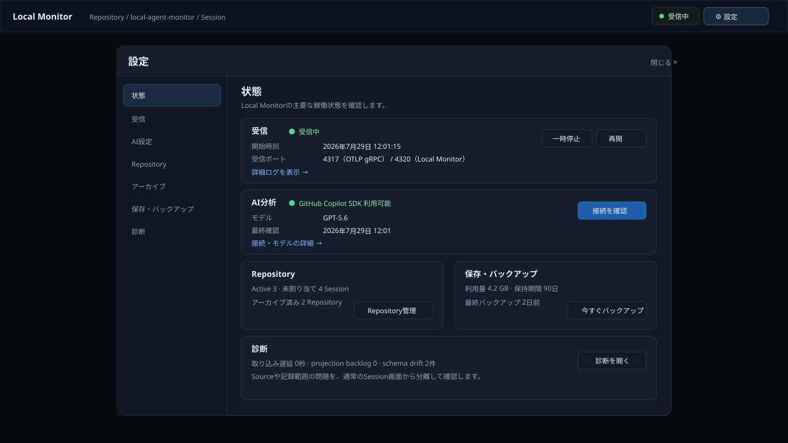

# Local Monitor v1 UX0 — Visual review package

Issue: #153  
Viewport: **1366 × 768**  
Status: **Product Owner review pending**

この資料は、画面の構造・情報優先度・主要操作をレビューするためのものです。色や細部だけの承認ではなく、各画面が答える問いと導線が正しいかを確認します。

## 1. Repository選択


確認事項:

- Repositoryカードの情報量は、表示名・Session件数・最終観測で十分か
- `すべてのSession`、`Repository未割り当て`、`Repositoryを追加`の位置
- Archive済みRepositoryへの入口

## 2. Session Explorer


確認事項:

- 一覧の情報密度
- `比較を作成`が通常のSession発見を邪魔していないか
- Tokenとcache-read ratioの一覧表示
- preview paneなしで目的のSessionを見つけられるか

## 3. Compare selection mode


確認事項:

- 通常時はcheckboxを出さず、明示的にselection modeへ入る構造
- 基準/変更後の割り当て
- bottom action barの情報量

## 4. Repository Session Compare


確認事項:

- 合計Dashboardではなく2 cohortの差に集中できているか
- `観測された差`と`改善`を混同していないか
- coverage / model差 / quality証拠不足の扱い
- Sessionへdrill downできる構造

## 5. Session Workspace


確認事項:

- Tokenとcacheの分離と横バー
- 階層型タイムラインで親子関係・並列性・durationが同時に読めるか
- Tool/Skill/Sub-agent選択時に右インスペクターだけが切り替わる構造
- 1366×768での情報密度

## 6. Session AI result


確認事項:

- AI結果が観測事実とは別surfaceになっているか
- timelineを残したままexact evidenceへ戻れるか
- `再分析` / `過去の分析`の位置
- summary / findings / improvement / limitations / provenanceの順序

## 7. Unified Settings modal



確認事項:

- 設定・受信・AI・Repository・Archive・保存・診断を1 modalに集約する方針
- 状態と管理操作が過不足なく見えるか
- 通常画面へ運用情報を常設しない方針

## Review result template

```text
1 Repository selection: Accept / Revise — ...
2 Session Explorer: Accept / Revise — ...
3 Compare selection: Accept / Revise — ...
4 Repository Compare: Accept / Revise — ...
5 Session Workspace: Accept / Revise — ...
6 Session AI result: Accept / Revise — ...
7 Settings modal: Accept / Revise — ...
```
