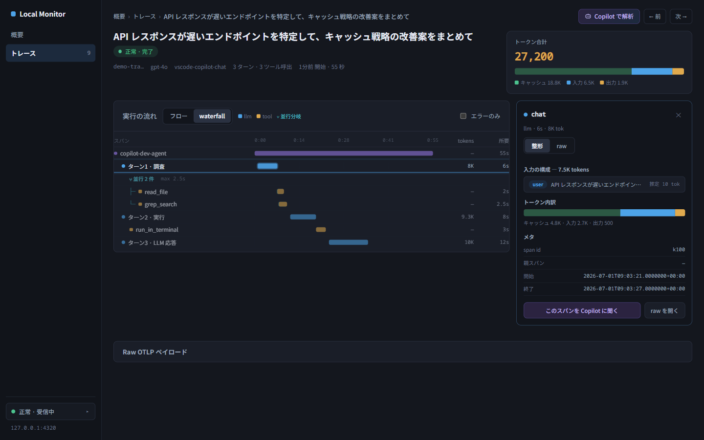
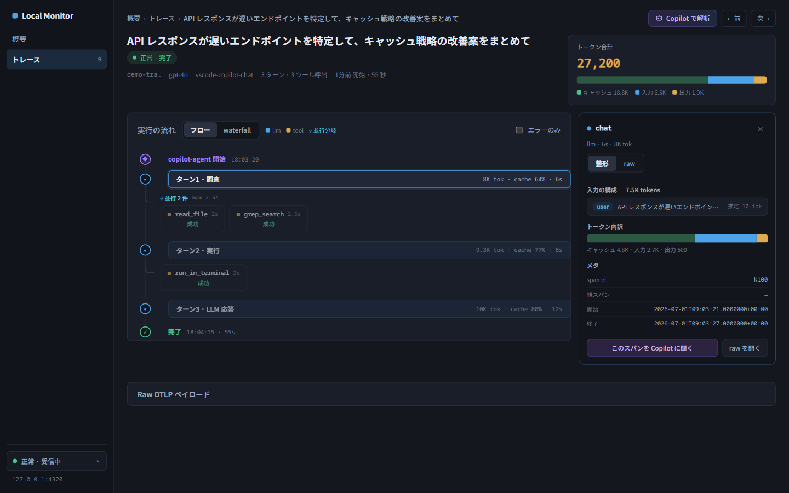
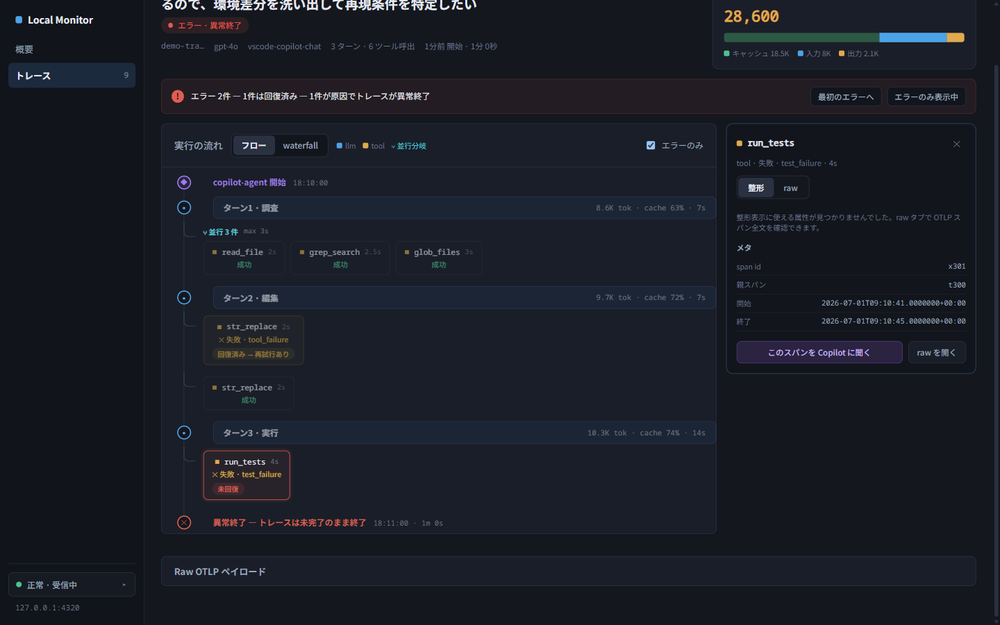
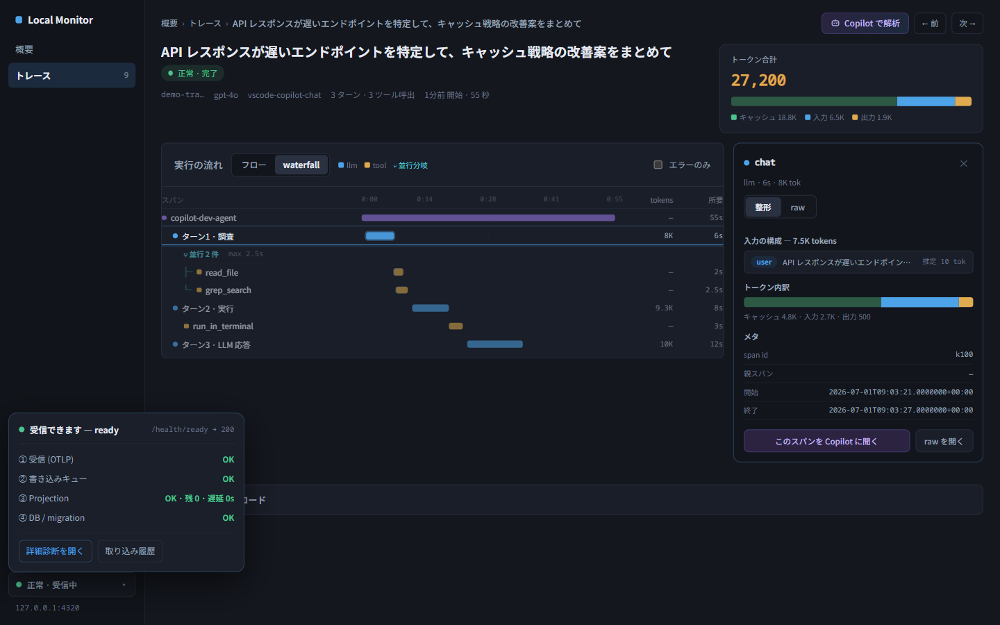

# Local Ingestion Monitor

Local Ingestion Monitor（`CopilotAgentObservability.LocalMonitor`）は、VS Code GitHub
Copilot Chat や GitHub Copilot CLI から送られてくる OTLP HTTP/protobuf テレメトリを
ローカルで受け取り、ブラウザ UI でリアルタイムに確認するための単一プロセスツールです。

Langfuse、Docker Desktop、外部ネットワークは不要です。
ループバック（`127.0.0.1`）にバインドし、同一マシン内でのみ動作します。

## 何が確認できるか

UI は Console 型の構成です。左に 208px のサイドバー（ナビは **概要 / トレース** の
2 項目のみ）、下部に受信ステータスバッジがあり、診断はバッジ → ポップオーバー →
「詳細診断を開く」の段階的動線で開きます（`/diagnostics` への直接アクセスも可能）。

画面は次の 7 つです。

| 画面 | 開き方 | 内容 |
|---|---|---|
| 概要 | `http://127.0.0.1:4320/` | トークン KPI（実消費 / 実効入力換算 / キャッシュ読取率 / エラー trace）、期間トグル（今日 / 7日 / 30日）、モデル別内訳、キャッシュ効率、高コスト trace TOP5、時間帯別トークン、最近のトレース |
| トレース一覧 | `/traces` | テーブル + 右プレビューパネルの master-detail。プロンプト / モデル / 状態 / 期間で絞り込み、トークン・所要・時刻でソート |
| トレース詳細 | `/traces/{traceId}` | 実行の流れを **フロー / waterfall** セグメントで切替表示。ターンカード、並行ツールのグループ表現、失敗 → 再試行の回復ペア、右列に常設のキャッシュ列 |
| スパンインスペクタ | 詳細画面でスパンをクリック | 右パネルに **整形 / raw** タブ。整形はメッセージ構成・トークン内訳・メタ、raw は OTLP span JSON 全文 |
| エラー解析モード | エラーを含む trace の詳細画面 | エラー要約ストリップ、エラー一覧（回復済み / 未回復）、エラー詳細、入力トークン推移（128K 上限の目安線付き） |
| Copilot 解析ドロワー | 詳細画面の「Copilot で解析」 | 観点を選んで raw trace をローカルの Copilot SDK で解析。チャット形式の追い質問（履歴再送）に対応 |
| 診断 | ステータスバッジ → ポップオーバー →「詳細診断を開く」 | 取り込みパイプライン 4 段の状態、コンポーネント確認、readiness しきい値、取り込み履歴 |

主な API は次のとおりです。

| API | 内容 |
|---|---|
| `GET /health/ready` | `200 ready` / `200 degraded` / `503 not_ready` |
| `GET /api/monitor/overview` | 概要 KPI（sanitized、`period` クエリ対応） |
| `GET /api/monitor/trace-list` | 一覧用 trace 行（sanitized、フィルタ / ソート対応） |
| `GET /api/monitor/ingestions` | cursor 付き sanitized ingestion API（取り込み履歴） |
| `GET /api/monitor/traces` | cursor 付き sanitized trace API（rollup 列付き） |
| `GET /api/monitor/traces/{traceId}/spans` | cursor 付き sanitized span API |
| `GET /traces/{traceId}/spans/{spanId}/detail` | スパンインスペクタ用の raw-bearing span 詳細（`--sanitized-only` 時は 404） |

API（`/api/monitor/*`）と SSE は **sanitized metadata のみ** を返します（プロンプトを含みません）。
raw body（tool arguments / results、sub-agent instructions / responses、system prompt）と PII は
既定で trace-detail page に表示されます（server-rendered、inert text）。さらに、トレースを
不透明な TraceId ではなく入力プロンプトで識別できるよう、**概要とトレース一覧でも
代表プロンプトを既定で表示**します（D032。raw store の OTLP から server 側で抽出した inert text。
same-origin / `Cache-Control: no-store` を強制）。`--sanitized-only` を付けて起動すると
metadata-only モードになり、raw 由来の表示（プロンプト、インスペクタの raw タブ、
Copilot 解析ドロワー、raw route）を除外して短縮 TraceId に切り替えます。

## 必要なもの

- Release ZIP 利用時: `local-monitor-win-x64.zip`
- repository から起動する場合: .NET SDK（`global.json` で固定されたバージョン）
- VS Code + GitHub Copilot Chat 拡張機能（VS Code source の場合）
- GitHub Copilot CLI（CLI source の場合）
- GitHub アカウント（Copilot サブスクリプション）

## 起動手順

### Step 1A — Release ZIP から起動する

`local-monitor-win-x64.zip` を展開し、展開先で次を実行します。

```powershell
.\scripts\install.ps1
.\scripts\start.ps1 -Mode Published
.\scripts\status.ps1
```

Release ZIP は self-contained publish です。利用者端末で `dotnet run` /
`dotnet build` / `dotnet restore` を実行せず、.NET SDK / .NET Runtime /
ASP.NET Core Runtime の事前導入も前提にしません。

`install.ps1` は app 本体を次の install root にコピーするだけです。既定では起動も
Task Scheduler 登録もしません。

```text
%LOCALAPPDATA%\CopilotAgentObservability\LocalMonitor\app\
```

今すぐ起動する場合は `start.ps1 -Mode Published` を実行します。次回ログオン時から
自動起動したい場合だけ、別途 Task Scheduler 登録を行います。

```powershell
.\scripts\install-startup-task.ps1 -Mode Published
.\scripts\set-startup-task.ps1 -Action Disable
.\scripts\set-startup-task.ps1 -Action Enable
```

停止・解除:

```powershell
.\scripts\stop.ps1 -Force
.\scripts\uninstall-startup-task.ps1 -StopRunning
```

uninstall は既定で DB / logs を保持します。明示的に削除したい場合のみ
`-RemoveData -Force` を付けます。

### Step 1B — repository からモニターを起動する

```powershell
New-Item -ItemType Directory -Force data | Out-Null
dotnet run --project src\CopilotAgentObservability.LocalMonitor -- --db data\monitor.db --url http://127.0.0.1:4320
```

起動したらブラウザで `http://127.0.0.1:4320/` を開いてください。
`/health/ready` が `200 ready` を返したら受信準備完了です。

> `dotnet run` は Web SDK の既定で作業ディレクトリをプロジェクトディレクトリに
> 設定するため、相対 `--db` は `src\CopilotAgentObservability.LocalMonitor\` 基準で
> 解決されます。DB の場所を固定したい場合は絶対パスを指定してください。

オプション:

| オプション | 既定値 | 説明 |
|---|---|---|
| `--db` | `data/raw-store.db` | SQLite raw store のパス |
| `--url` | `http://127.0.0.1:4320` | ループバック bind URL（非ループバックは拒否） |
| `--sanitized-only` | off | metadata-only モード。raw 由来の表示（プロンプト、インスペクタ raw タブ、Copilot 解析ドロワー、raw route）と PII を除外する任意 opt-out。 |
| `--apply-root user_config=<absolute-directory>` | なし | proposal apply で使う明示登録済みのローカル user-config root |
| `--apply-root skill=<absolute-directory>` | なし | proposal apply で使う明示登録済みのローカル Skill root |
| `--apply-root repository=<absolute-directory>` | なし | proposal apply で使う明示登録済みの repository working-tree root |

### Canvas proposal をローカルへ適用する

この操作は既存 proposal を明示承認してから行う、Local Monitor のローカル専用操作です。
適用 root は推測されず、API から登録することもできません。起動時に必要な root だけを
絶対パスで明示指定します。以下の `<...>` は実在するローカルディレクトリに置き換える
ためのプレースホルダーです。

```powershell
dotnet run --project src\CopilotAgentObservability.LocalMonitor -- --db <absolute-db-path> --url http://127.0.0.1:4320 `
  --apply-root user_config=<absolute-user-config-directory> `
  --apply-root skill=<absolute-skill-directory> `
  --apply-root repository=<absolute-repository-working-tree-directory>
```

指定した root そのもの、および volume root までの祖先に symlink / junction / reparse
point がある場合は起動を拒否します。対象にできるのは、設定済み root 配下にすでに存在する
通常ファイルだけです。ディレクトリ、作成、削除、名前変更、任意パスの登録はできません。

Canvas の Improve で既存 proposal を選び、**Apply locally** を開いた後の手順は次のとおりです。

1. token-gated helper で下書きと full diff を確認する。
2. ファイルまたは hunk を選択し、選択後の diff を確認する。
3. 選択内容を明示承認する。
4. 承認済み下書きだけを別操作で apply する。
5. apply 後に戻す必要がある場合だけ、現在のファイル hash が apply 直後の hash と一致するときに限り、一度だけ rollback する。

選択対象のいずれかの base hash が stale なら、**選択した全ファイルに対して書き込みは
行われません**。snapshot / journal を使う起動時 recovery も fail-closed です。安全に
復旧できない未完了 transaction がある場合は、その root を推測して復旧せず、適用・rollback
を受け付けません。

パス、source、full diff は token-gated helper と下書き表示の境界内だけで扱われます。Canvas
action、`session.send()`、git branch / commit / push / PR 操作はファイルを適用しません。

### Windows logon startup

Windows では、Task Scheduler の user-level task として LocalMonitor をログオン時に
起動できます。Task Scheduler 登録は install とは別の明示操作です。

```powershell
.\scripts\local-monitor\install-startup-task.ps1 -StartNow
.\scripts\local-monitor\status.ps1
```

既定では `http://127.0.0.1:4320` で起動し、DB / logs / state は
`%LOCALAPPDATA%\CopilotAgentObservability\LocalMonitor\` 配下に保存します。
metadata-only の常時起動にしたい場合は `-SanitizedOnly` を付けます。

```powershell
.\scripts\local-monitor\install-startup-task.ps1 -SanitizedOnly -StartNow
```

Task Scheduler 登録 script は VS Code 設定を書き換えません。クライアントを
monitor に向ける設定は、次の Step 2 の user environment script または Config CLI
出力を使います。

停止・解除:

```powershell
.\scripts\local-monitor\stop.ps1 -Force
.\scripts\local-monitor\uninstall-startup-task.ps1 -StopRunning
```

登録済み startup の有効化・無効化:

```powershell
.\scripts\local-monitor\set-startup-task.ps1 -Action Disable
.\scripts\local-monitor\set-startup-task.ps1 -Action Enable
```

詳細は [Task Scheduler operation](../operations/local-monitor-task-scheduler.md) を参照してください。

### Step 2 — クライアントの環境変数を永続化する

Windows ユーザーで新しく起動する VS Code GitHub Copilot Chat と GitHub Copilot CLI
を常に monitor に向けるには、current user の永続環境変数を設定します。

Release ZIP:

```powershell
.\scripts\install-user-env.ps1
```

Repository:

```powershell
.\scripts\local-monitor\install-user-env.ps1
```

この script は user scope（HKCU user environment）だけを更新し、管理者権限を要求しません。
`setx` は使わず、Windows の user environment API で値を保存して環境変更通知を送ります。
既に起動済みの VS Code、terminal、Copilot CLI には反映されないため、設定後に再起動してください。

設定を解除する場合:

```powershell
.\scripts\uninstall-user-env.ps1
```

Repository からは `.\scripts\local-monitor\uninstall-user-env.ps1` を使います。

user environment は VS Code と Copilot CLI で共有されるため、`OTEL_RESOURCE_ATTRIBUTES`
には `client.kind` を設定しません。クライアント種別より、同じ Windows ユーザーで起動する
全プロセスの常時収集を優先する運用です。

### 代替 — 一時的に現在のシェルだけへ適用する

**VS Code GitHub Copilot Chat の場合：**

```powershell
dotnet run --project src\CopilotAgentObservability.ConfigCli -- profile-vscode-env --profile raw-local-receiver --target monitor
```

出力された環境変数を現在の PowerShell セッションに適用し、同じシェルから VS Code を起動します。

```powershell
# 出力結果を貼り付けて実行してから：
code .
```

**GitHub Copilot CLI の場合：**

```powershell
dotnet run --project src\CopilotAgentObservability.ConfigCli -- profile-copilot-cli-env --profile raw-local-receiver
```

出力された環境変数を適用してから `gh copilot` コマンドを実行します。

### Step 3 — Copilot を使う

VS Code で Copilot Chat に質問する、または `gh copilot -- -p "..."` を実行します。
モニターはリアルタイムでテレメトリを受信し、ブラウザ UI が自動更新されます。

### Step 4 — ブラウザで確認する

`http://127.0.0.1:4320/`（概要）を開くと、トークン KPI と最近のトレースが表示されます。
受信直後に projection が走り、`/traces`（トレース一覧）に集約された trace 行が現れます。
各トレースは入力プロンプトで識別できます（既定）。

## モックデータで試す

Copilot を使わなくても、リポジトリ同梱の合成モックデータで全画面の動作を確認できます。
モックデータは完全な合成データで（trace id は `demo-` プレフィックス、
`user.email` はダミー値）、実プロンプトや PII を含みません。

```powershell
# ターミナル A — 使い捨て DB でモニターを起動
dotnet run --project src\CopilotAgentObservability.LocalMonitor -- --db tmp\monitor-demo\monitor.db --url http://127.0.0.1:4320

# ターミナル B — モックデータを投入
pwsh scripts\demo\seed-monitor-mock-data.ps1 -MonitorUrl http://127.0.0.1:4320
```

投入されるのは 9 トレースです: 3 ターン + 並行ツール + キャッシュトークン入りの
リッチトレース（正常 / 回復済みエラー / 異常終了の 3 種）、エラー一覧用の最小回復ケース、
モデル・クライアント・トークン量を変えた一覧用トレース 4 件、概要用の単発トレースです。
概要 KPI、一覧のフィルタ・ソート、詳細のフロー / waterfall、キャッシュ列、
スパンインスペクタ、エラー解析モードがすべて点灯します。

注意点:

- **1 つの DB につき投入は 1 回**にしてください。同じ DB へ再投入すると同一 trace の
  スパンが重複します。やり直すときは、新しい `--db` パスでモニターを起動し直してから
  再投入してください。
- 投入直後は全データが「今日」の受信になるため、概要の期間トグル
  （今日 / 7日 / 30日）はどの期間でも同じ値になります（実運用の初日と同じ挙動です）。
- Copilot 解析ドロワーの実行には、ローカルで利用可能な GitHub Copilot SDK
  （または BYOK provider 設定）が必要です。未設定の場合、解析 run は
  Failed で終了します（ドロワー UI 自体の表示は確認できます）。

## ポートとプロファイルの対応

| クライアント | 生成コマンド | 既定エンドポイント |
|---|---|---|
| VS Code / Copilot CLI（Windows user env） | `install-user-env.ps1` | `http://127.0.0.1:4320` |
| VS Code Copilot Chat（monitor） | `profile-vscode-env --profile raw-local-receiver --target monitor` | `http://127.0.0.1:4320` |
| VS Code Copilot Chat（legacy receiver） | `profile-vscode-env --profile raw-local-receiver` | `http://127.0.0.1:4319` |
| GitHub Copilot CLI | `profile-copilot-cli-env --profile raw-local-receiver` | `http://127.0.0.1:4319` |

CLI の既定は `4319`（ConfigCli receiver）です。モニター（4320）に向けるには
`OTEL_EXPORTER_OTLP_ENDPOINT=http://127.0.0.1:4320` を上書きしてください。

## 画面ガイド

### 概要

トークンコストの把握を最優先にした KPI ダッシュボードです。今日 / 7日 / 30日の
期間トグルと、次の KPI を表示します。

- **実消費トークン**: 未キャッシュ入力 + 出力（= 総量 − キャッシュ読取）。
  agent セッションは毎ターン履歴を再送するため、キャッシュ読取込みの総量は
  大半がキャッシュで占められます。ヒーロー数値は実際に新規処理された
  トークンとし、キャッシュ読取込みの総量とキャッシュ読取量は同カードの
  内訳行に表示します。前期間比較も実消費ベースです。
- **実効入力換算**: キャッシュ読取 = 0.1x 換算のコスト近似。
- **キャッシュ読取率**: キャッシュ読取トークン ÷ 入力トークン
  （入力トークンはキャッシュ読取分を含む値）。カードに分子 ÷ 分母の
  内訳行を表示するので、率の根拠を数値で確認できます。
- **エラー trace 数**: クリックでエラーのみの一覧へドリルダウン。

下段にはモデル別トークン内訳、モデル別キャッシュ効率、高コスト trace
TOP5、時間帯別トークン分布、最近のトレースが並びます。

<p align="center">
  
</p>

### トレース一覧

テーブル + 右プレビューパネル（master-detail）です。行はプロンプト / モデル /
トークン / cache% / 所要 / 時刻で構成され、既定はトークン降順です。上部の検索
（プロンプト・TraceId）、モデル / 状態（正常・エラー・回復済み・異常終了）/ 期間の
フィルタで絞り込めます。行をクリックすると、ページ遷移せずに右パネルへミニ KPI・
トークン構成・コストの大きいスパン TOP3 が表示され、「詳細を開く」で詳細画面へ
進めます。

> プロンプト検索は server 側の TraceId 部分一致 + client 側の読み込み済み行の
> prompt label フィルタです（全コーパスの prompt 全文検索は未対応。D042 C8）。

<p align="center">
  
</p>

### トレース詳細（フロー / waterfall + キャッシュ列）

trace を開くと、パンくず・プロンプト見出し・状態ピル（正常 / エラー · 回復済み /
エラー · 異常終了）・トークン合計（キャッシュ / 入力 / 出力の内訳）の下に、
「実行の流れ」が表示されます。旧タブ構成（概要 / タイムライン / ツリー・フロー /
キャッシュ）は廃止され、**フロー | waterfall** のセグメント切替 + 右列の常設
キャッシュ列という 1 画面構成になりました。

- **フロー**: ターンカード（ターン番号 · 意図ラベル · トークン · cache% · 所要）を
  時系列に並べ、ツール呼出をカードで表現します。時間の重なる並行ツールは
  「⑂ 並行 N 件」グループとして横並びに、失敗 → 再試行は「✕ 失敗 ·
  種別」「回復済み → 再試行あり」のペアとして表示します。
- **waterfall**: 時間軸に沿ったバー表示です。並行グループは `⑂ 並行 N 件` 見出しと
  `├─` / `└─` プレフィックスで表現し、tokens 列は LLM ターンにのみ値が入ります。
- **キャッシュ列**（エラーのない trace）: 読取率、キャッシュ読取 / 作成、
  未キャッシュ入力、実効入力換算、ターン別キャッシュ読取率のバーを常設表示します。
- ビュー選択とスパン選択は URL（`?view=waterfall&span=...`）に保存され、
  リロードや共有で復元されます。

<p align="center">
  
</p>

<p align="center">
  
</p>

### スパンインスペクタ

フローまたは waterfall のスパンをクリックすると、右列がスパンインスペクタに
切り替わります（✕ / Esc / 同一スパン再クリックで閉じて元の列に戻ります）。

- **整形タブ**（既定）: LLM スパンは入力の構成（メッセージ）とトークン内訳、
  ツールスパンは引数・結果のプレビュー、共通でスパン id / 親スパン / 開始・終了の
  メタを表示します。
- **raw タブ**: `GET /traces/{traceId}/spans/{spanId}/detail` から取得した
  OTLP span JSON 全文を表示します（「JSON をコピー」付き）。整形抽出が
  できないスパンでも raw タブは常に機能します。
- `--sanitized-only` では raw 由来の詳細は表示されず、sanitized なスパン情報のみに
  なります（detail route 自体が 404）。

<p align="center">
  
</p>

### エラー解析モード

エラーを含む trace を開くと、詳細画面がエラー解析モードになります。

- 見出し下の状態ピルが「エラー · 回復済み」または「エラー · 異常終了」になります。
  回復済み = 失敗の後に成功があった trace、異常終了 = 最後のスパンが失敗した trace です。
- エラー要約ストリップ（例: 「エラー 2件 — 1件は回復済み — 1件が原因でトレースが
  異常終了」）と「最初のエラーへ」ボタンが表示され、フローは「エラーのみ」表示が
  既定で ON になります。
- 右列はキャッシュ列の代わりにエラーパネルになり、エラー一覧（回復済み = 琥珀 /
  未回復 = 赤）、エラー詳細（span id・種別・発生ターン・モデル・例外メッセージ）、
  「原因の手がかり — 入力トークンの推移」（128K 上限の赤破線付きターン別バー）を
  表示します。エラー行をクリックするとフロー側の該当カードが選択されます。

<p align="center">
  
</p>

### Copilot 解析ドロワー

詳細画面ヘッダーの「Copilot で解析」で右からドロワーが開きます（詳細は
[Copilot raw analysis](#copilot-raw-analysis) を参照）。観点（トークン / キャッシュ /
エラー / 遅延 / ツール利用 / エージェントの流れ / 指示診断）を選んで実行すると、captured raw
trace をローカルの .NET GitHub Copilot SDK で解析し、所見を表示します。所見に対しては
サジェストチップまたは自由入力でチャット形式の**追い質問**ができます。追い質問は
新規 analysis run として過去の Q&A を再送する方式（履歴再送。D045）で、会話履歴が
server に永続化されることはありません。

ドロワーには「ローカル SDK 経由 · raw はローカルから出ません」というデータ境界の
表示が常にあります。`--sanitized-only` ではボタンとドロワー自体が存在しません。

<p align="center">
  
</p>

### 診断

サイドバー下部の受信ステータスバッジ（「正常 · 受信中」等）をクリックすると
ポップオーバーが開き、`/health/ready` の結果と取り込みパイプライン 4 段
（① 受信 / ② 書き込みキュー / ③ Projection / ④ DB · migration）の状態を確認できます。
「詳細診断を開く」で `/diagnostics` へ、「取り込み履歴」で
`/diagnostics#ingestion-history`（履歴セクションが展開された状態）へ進みます。

<p align="center">
  
</p>

診断ページでは、パイプライン各段の詳細、コンポーネント確認（loopback bind / DB /
migration / writer / projection worker / ingestion queue）、readiness しきい値の実効値、
取り込み履歴（raw record と trace の対応、sanitized metadata のみ）を確認できます。
診断ページでもナビは 2 項目のままです。

<p align="center">
  
</p>

## raw body 表示（既定）

raw body（tool arguments / results、sub-agent instructions / responses、system prompt）と
PII（`user.id` / `user.email`）は **既定で表示されます**。trace-detail page（スパン
インスペクタの raw タブと raw OTLP ペイロードセクション）に描画され、
`GET /traces/{rawRecordId}/raw` でも個別の raw OTLP JSON を確認できます。
加えて、概要とトレース一覧、trace 詳細の見出しでは、各トレースの**代表入力
プロンプト**を server 側で抽出して表示します（D032。プロンプトのみ raw 扱いで、他の列は
sanitized メタデータ。`/api/monitor/*` と SSE はプロンプトを含みません）。

raw を表示する全ページ（概要 / trace 一覧 / trace 詳細 / raw route）は次を満たします:

- same-origin アクセスのみ（cross-site は `403`）
- `Cache-Control: no-store`
- HTML エスケープされた inert text として描画（スクリプト実行なし）

`--sanitized-only` を付けて起動すると raw body と PII、プロンプト表示は非表示になります。
概要 / 一覧 / 見出しのプロンプトは短縮 TraceId に切り替わり、スパンインスペクタの
raw タブは sanitized なスパン情報のみになり、Copilot 解析ドロワーは表示されず、
`GET /traces/{rawRecordId}/raw` と `GET /traces/{traceId}/spans/{spanId}/detail` は
`404` です。metadata-only 表示が必要な場合に使用できます。

raw store や表示内容には prompt / response / tool 情報が含まれる場合があります。
raw store ファイル（`data\monitor.db` 等）を repository に commit しないでください。

## SSE によるリアルタイム更新

`GET /events`（`text/event-stream`）を購読すると、新しい取り込みが projection されるたびに
通知（`data: {}`）が届きます。ブラウザの概要や `/traces` はこれを使って
自動的に API を再読み込みします。

通知には raw payload・PII を含みません。

## readiness の見方

`GET /health/ready` のレスポンス例：

```json
{
  "status": "ready",
  "checks": {
    "loopback_bound": true,
    "db_open": true,
    "migration_complete": true,
    "writer_running": true,
    "projection_worker_running": true,
    "ingestion_accepting": true,
    "projection_lag_seconds": 0,
    "projection_backlog": 0
  },
  "degraded_reasons": []
}
```

| status | HTTP | 意味 |
|---|---|---|
| `ready` | 200 | 全チェック通過 |
| `degraded` | 200 | 軽微な一時的状態（瞬間的なバックプレッシャーなど） |
| `not_ready` | 503 | 必須ゲートが未通過（DB 未接続・writer 停止など） |

## データ安全

- `data\monitor.db`、`data\monitor-*.db` は local runtime artifact です。repository に commit しないでください。
- Task Scheduler 起動時の既定 DB / logs / state は `%LOCALAPPDATA%\CopilotAgentObservability\LocalMonitor\` 配下に保存されます。これらも repository に commit しないでください。
- 既定で raw body（prompt / response / tool arguments / results）と PII が表示されます。metadata-only 表示が必要な場合は `--sanitized-only` を付けて起動できます。
- モニターはループバックにのみバインドします。非ループバック URL は起動時に拒否されます。
- ログに raw prompt / response / tool arguments / results は出力しません。

詳細は [Data Safety](data-safety.md) と
[docs/specifications/security-data-boundaries.md](../specifications/security-data-boundaries.md) を参照してください。

## Copilot raw analysis

raw default の Local Monitor では、trace 詳細の「Copilot で解析」ドロワーから
raw analysis run を開始できます。これは captured raw trace / raw record / span context を
.NET GitHub Copilot SDK analysis service に渡し、ローカル診断として分析する機能です。

### 使い方

1. `--sanitized-only` を付けずに Local Monitor を起動します。
2. `/traces/{traceId}` を開き、ヘッダーの「Copilot で解析」を押します。
3. 観点を選んで「解析を実行」します。
   - トークン（tokens）
   - キャッシュ（cache）
   - エラー（errors）
   - 遅延（latency）
   - ツール利用（tool-usage）
   - エージェントの流れ（agent-flow）
   - 指示診断（instruction-diagnosis）
4. 生成された run id の状態を Local Monitor が polling し、.NET SDK analysis
   result をローカル runtime data としてドロワー内に表示します。
5. 所見に対してサジェストチップまたは自由入力で追い質問できます。各追い質問は
   過去の Q&A を含めて再送する新規 run です（履歴再送。D045）。

実行にはローカルで利用可能な GitHub Copilot SDK（または下記 BYOK provider 設定）が
必要です。利用できない場合、run は Failed で終了します（UI は失敗メッセージを表示）。

スパンインスペクタの「このスパンを Copilot に聞く」からも、選択スパンを文脈にした
解析を開始できます。

`--sanitized-only` では raw analysis UI と routes は表示・提供されません。

### Copilot raw analysis BYOK

Local Monitor は .NET GitHub Copilot SDK の BYOK provider 設定を
`CopilotAnalysis:*` から読みます。Secret Manager で設定する例:

```powershell
dotnet user-secrets init --project src\CopilotAgentObservability.LocalMonitor
dotnet user-secrets set "CopilotAnalysis:Enabled" "true" --project src\CopilotAgentObservability.LocalMonitor
dotnet user-secrets set "CopilotAnalysis:Model" "glm-5.2" --project src\CopilotAgentObservability.LocalMonitor
dotnet user-secrets set "CopilotAnalysis:Provider:Type" "openai" --project src\CopilotAgentObservability.LocalMonitor
dotnet user-secrets set "CopilotAnalysis:Provider:BaseUrl" "https://<endpoint>/v1" --project src\CopilotAgentObservability.LocalMonitor
dotnet user-secrets set "CopilotAnalysis:Provider:WireApi" "completions" --project src\CopilotAgentObservability.LocalMonitor
dotnet user-secrets set "CopilotAnalysis:Provider:ApiKey" "<api-key>" --project src\CopilotAgentObservability.LocalMonitor
```

`CopilotAnalysis:BaseDirectory` を指定しない場合、Local Monitor は writable な
temporary local directory を Copilot SDK runtime state として使います。API key は
analysis events、UI、repository-safe summary には出力しません。

`CopilotAnalysis:TimeoutSeconds`（既定 `60`）は 1 回の解析実行に許容する SDK
send/wait タイムアウト秒です。実際の Copilot CLI トレースは raw payload が
大きく、reasoning 系 BYOK モデルでは既定 60 秒で完走しないことがあります。
その場合は例えば `600` を設定してください:

```powershell
dotnet user-secrets set "CopilotAnalysis:TimeoutSeconds" "600" --project src\CopilotAgentObservability.LocalMonitor
```

### 出力境界

- Raw analysis result は local runtime data です。
- GitHub Issue / docs / dashboard に出す場合は `safe-summary` route の
  repository-safe summary だけを使います。
- raw prompt / response / full tool arguments / full tool results / PII /
  credentials / local sensitive path は repository-safe summary に含めません。

## GitHub Copilot app Canvas adapter

Local Ingestion Monitor は GitHub Copilot app extension（Canvas adapter）経由で
Copilot CLI から参照できます。Canvas extension は
`.github/extensions/otel-monitor-canvas/extension.mjs` に配置された
project-scoped extension で、モニター UI を再実装せず、既存の
`/api/monitor/*` API と `/health/ready` から bounded action response を返します。

### Local Monitor 姿勢

Canvas adapter は通常起動の raw default Local Monitor と併用できます。
`--sanitized-only` は Canvas 用の必須設定ではなく、metadata-only にしたい場合の
任意モードです。このモードでも sanitized な画面（概要 / 一覧 / 詳細の sanitized
表示）は使えますが、raw 由来の表示と raw route は非表示になります。

### 必要なもの

- GitHub Copilot app（Canvas extension runtime をサポートするバージョン）
- Local Ingestion Monitor を loopback で起動済み

### 使い方

1. モニターを起動します。

   ```powershell
   dotnet run --project src\CopilotAgentObservability.LocalMonitor -- --db data\monitor.db --url http://127.0.0.1:4320
   ```

   必要に応じて `--sanitized-only` を追加すると raw 由来の表示 / raw route / PII は
   除外されます。

   `/health/ready` が `200 ready` を返すことを確認してください。

2. Copilot app で Canvas extension を開きます。Copilot app は
   `.github/extensions/otel-monitor-canvas/` を自動検出します。Canvas id は
   `otel-monitor` です。

3. `open()` が完了すると、拡張所有の loopback Session Workspace
   （`http://127.0.0.1:<port>/?t=<token>`）が開きます。左側でこの会話に
   exact-bound された Session、最近の Session、未紐付け Session を選べます。
   Review / Evidence / Improve / Compare の 4 tab があり、Improve / Compare は
   後続機能の placeholder です。従来の trace 分析画面は `/analysis` にあります。

4. ボタンを押すと、Copilot に bounded analysis 指示が送信されます。Copilot は
   Canvas actions（`monitor_health`、`list_recent_traces`、`get_trace_summary`、
   `get_trace_span_tree`、`get_cache_summary`）を呼び出して trace を分析します。

### Evidence tab

Evidence は選択 Session の run に exact-linked された trace だけを表示します。
各 trace の Agent forest は別々に保たれ、Agent / Subagent の親子関係、caller、
parallel、exact / 推定 / 判定不能は Local Monitor の Agent graph をそのまま使います。
Session event は run が trace に結び付いていても常に `Session / unowned` で、Agent
への所属を推測しません。

下部のタイムラインは sanitized OTel spans と Session event metadata を時刻順に
表示します。右の Inspector は選択した Agent、span、event の sanitized fields と
`content_state` を表示します。型付きの Skill 名/パス/バージョン、test/review 結果が
ない場合は「利用不可」です。tool 名や出力から合否や Skill を推測しません。

exact-linked trace がない場合も Session event timeline は利用できます。Agent graph
は利用不可と明示されます。Monitor が `400` / `404` / `503` を返した trace は error
として表示され、別 trace や latest trace への fallback はありません。Agent graph
と spans は独立して取得されるため、一方だけ失敗した場合も、取得できた側の証拠は
残り、失敗した側だけにエラーが表示されます。

### Canvas actions

| Action | 入力 | 出力 |
|---|---|---|
| `monitor_health` | なし | モニター到達性・readiness 状態・Canvas adapter 診断メッセージ |
| `list_recent_traces` | `limit`（1..50）、`status?`（ok/error）、`model?` | 最近の trace の sanitized メタデータ一覧 |
| `get_trace_summary` | `traceId` | trace 全体サマリー・top spans・models・cache totals |
| `get_trace_span_tree` | `traceId` | span の親子階層（sanitized）または flat diagnostic |
| `get_cache_summary` | `traceId` | cache トークン指標・per-turn breakdown・cache hit rate |

全ての action response は bounded DTO です。raw prompt / response body、
tool arguments / results、PII、credential、token、local sensitive path、raw monitor
payload は含まれません。raw details は Local Monitor UI の loopback / same-origin
境界内で扱います。

### セキュリティ境界

- 拡張所有の HTTP server は `127.0.0.1` のみにバインドします。
- ヘルパーページとプロキシ route は per-launch token で保護されます。
- `onClose()` で server が閉じられます。
- 外部 CDN / remote fetch は行いません。
- 診断は `session.log()` を使用し（`console.log` 不使用）、stdout を JSON-RPC 専用に保ちます。

詳細は [docs/specifications/security-data-boundaries.md](../specifications/security-data-boundaries.md)
と [docs/decisions.md](../decisions.md) D029 を参照してください。

## よくあるトラブル

| 症状 | 確認事項 |
|---|---|
| `http://127.0.0.1:4320/` に接続できない | LocalMonitor process が起動しているか確認。ポート番号を確認。 |
| `published_app_not_installed` | Release ZIP 展開先で `.\scripts\install.ps1` を実行したか、`-InstallRoot` が正しいか確認。 |
| Release ZIP 起動後に startup 登録されていない | install は startup 登録を行いません。必要な場合だけ `install-startup-task.ps1 -Mode Published` を実行してください。 |
| ingestion が増えない | `install-user-env.ps1` 後に VS Code / terminal / Copilot CLI を再起動したか確認。シェル一時適用の場合は、環境変数を設定したシェルから VS Code を起動したか確認。 |
| `degraded` が続く | 診断（ステータスバッジ → 詳細診断）で `projection_lag_seconds` と `projection_backlog` を確認。 |
| trace 詳細のスパンが重複して見える | 同じ trace id を同じ DB に複数回投入していないか確認（モックデータの再投入など）。新しい `--db` で起動し直すと解消します。 |
| Copilot 解析が Failed で終わる | ローカルで GitHub Copilot SDK が利用可能か、または `CopilotAnalysis:*` の BYOK 設定を確認。 |
| `dotnet run` がビルドエラーで失敗する | 既に同じプロジェクトのプロセスが動いている場合、DLL がロックされます。ビルド済み exe を直接実行してください：`src\CopilotAgentObservability.LocalMonitor\bin\Debug\net10.0\CopilotAgentObservability.LocalMonitor.exe --db data\monitor.db --url http://127.0.0.1:4320` |
