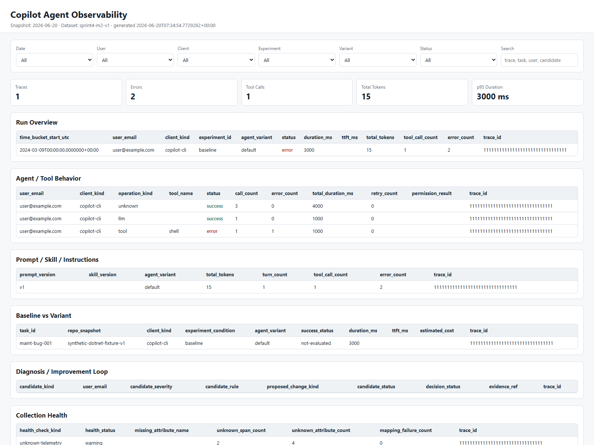
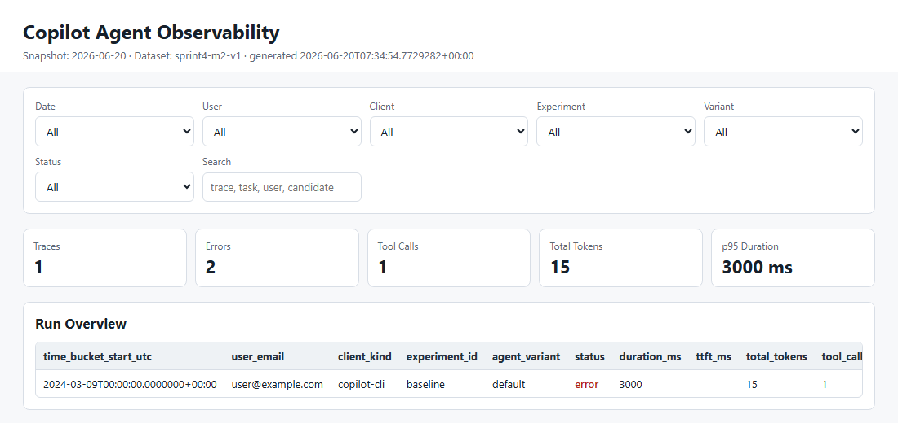

# Static Dashboard

Static dashboard は Agent workflow の aggregate view です。
個別 trace の詳細調査は Langfuse trace viewer、raw store、または明示 opt-in の sensitive bundle へ drill down します。

## 生成フロー

```text
normalized measurements
  -> generate-dashboard-dataset
  -> dashboard dataset JSON
  -> generate-static-dashboard
  -> index.html + dashboard-data.json
```

Synthetic fixture での生成例:

```powershell
New-Item -ItemType Directory -Force tmp\dashboard-demo | Out-Null
dotnet run --project src\CopilotAgentObservability.ConfigCli -- normalize-raw tests\CopilotAgentObservability.ConfigCli.Tests\TestData\raw-otlp.synthetic.json --json tmp\dashboard-demo\measurements.json
dotnet run --project src\CopilotAgentObservability.ConfigCli -- generate-dashboard-dataset tmp\dashboard-demo\measurements.json --raw tests\CopilotAgentObservability.ConfigCli.Tests\TestData\raw-otlp.synthetic.json --json tmp\dashboard-demo\dashboard.json
dotnet run --project src\CopilotAgentObservability.ConfigCli -- generate-static-dashboard tmp\dashboard-demo\dashboard.json --out-dir tmp\dashboard-demo\site --title "Copilot Agent Observability"
```

## 画面

<p align="center">
  
</p>

初期 view:

- Run Overview。
- Agent / Tool Behavior。
- Prompt / Skill / Instructions。
- Baseline vs Variant。
- Diagnosis / Improvement Loop。
- Collection Health。
- Outcome Linkage Candidate。

## Filter / Search / Sort

<p align="center">
  
</p>

初期 filter:

- date。
- user。
- client。
- experiment。
- variant。
- status。

Search は trace id、task、user、candidate などを対象にします。
Table header をクリックすると sort できます。

## GitHub Pages Snapshot

GitHub Actions workflow は以下を生成します。

```text
latest/index.html
latest/dashboard-data.json
YYYY-MM-DD/index.html
YYYY-MM-DD/dashboard-data.json
```

Daily snapshots は `gh-pages` branch と Pages artifact に保持します。
生成済み snapshot は main branch に commit しません。

実データ由来 aggregate を publish する前に確認すること:

- repository / organization の Pages access control。
- dashboard dataset に raw prompt / response / tool arguments / tool results が入っていないこと。
- `user.id` と `user.email` の表示が許容されていること。
- retention と削除手順。
- 利用者への周知。
